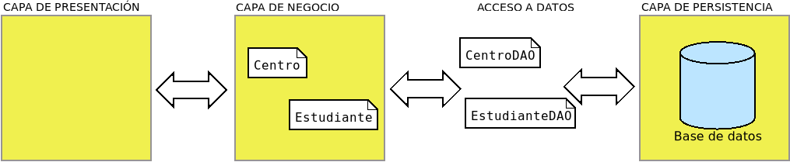

.. _conn-prog:

Programación con conectores
***************************
Como se ha podido ver hasta aquí, el acceso de una aplicación a una base de
datos relacional es relativamente sencillo y medianamente semejante sea cual
sea el lenguaje de programación y el |SGBD|. Por tanto, el usar de modo básico
conectores no entraña excesiva dificultad. Lo complicado, en realidad, es
abstraer al resto del programa del acceso, de modo que logremos que manipule
puramente objetos, aunque la información no esté almacenada según este modelo
en la base de datos.

Así pues, el propósito a seguir cuando se codifica una aplicación es que todas
las particularidades del acceso a datos estén reducidas a un paquete dentro de
la aplicación (p.ej. llamado *backend*), fuera del cual no haya otra cosa que
objetos.

Patrón |DAO|
============

Uno de los patrones más usados para lograr la abstracción es el `patrón DAO
<https://www.baeldung.com/java-dao-pattern>`_, que se carga de tomar los objetos
de la capa de negocio y transladarlos al soporte de persistencia o viceversa.
Retomando el ya manido :ref:`ejemplo de centros y alumnos <ej-centros-alumnos>`:

Este patrón básicamente:

+ Define una interfaz para establecer las operaciones |CRUD| y, quizás, algunas
  consultas más específicas.
+ Define clases (``CentroDAO``, ``EstudianteDAO``) que implementan la interfaz
  anterior para el soporte de datos que utilice la aplicación, el cual
  forzosamente no tiene por qué ser una base de datos relacional. Un cambio en
  el soporte implica rehacer estas implementaciones, sin alterar el resto de la
  aplicación.
+ El resto de la aplicación se encarga de utilizar la interfaz, por lo que es
  ajena a la implementación para un soporte particular.

.. seealso:: Todo el código que se describe y comenta en este apartado está en el
   `repositorio de GitHub TestDAO <https://github.com/josem-dam/TestDAO>`_. Se
   recomienda descargarlo para repasar mejor las explicaciones.

Por lo general, aunque no forzosamente, cada clase del modelo tendrá asociada
una clase |DAO|. Recordemos las clases del modelo (``Centro`` y
``Estudiante``), aunque en esta ocasión para intentar uniformizar la
implementación forzaremos a que ambas deriven de una interfaz que nos asegura que
ambas manejan de igual modo su identificador:

.. literalinclude:: files/Entity.java
   :name: clase-Entity

La clase ``Centro`` es esta:

.. literalinclude:: files/Centro.java
   :language: java
   :name: clase-centro
   :caption: Centro.java
   :class: toggle
   :start-at: public class

que incluye la definición del enum ``Titularidad``. La del ``Estudiante`` es esta
otra:

.. literalinclude:: files/Estudiante.java
   :language: java
   :name: clase-estudiante
   :class: toggle
   :caption: Estudiante.java
   :start-at: public class

Este es el modelo. Ahora necesitamos implementar el acceso a los datos. Eso
requiere definir la interfaz para las operaciones |CRUD|, que en un alarde de
originalidad llamaremos ``Crud``, y dos clases |DAO|, ``CentroSqlDAO`` y
``EstudianteSqlDAO``. La interfaz podemos establecerla como estimemos mejor,
mientras recoja todas las operaciones necesarias. Por ejemplo:

.. literalinclude:: files/Crud.java
   :language: java
   :class: toggle
   :name: clase-crud
   :caption: Crud.java
   :start-at: public interface

Nótese que la interfaz es genérica, porque tiene que servir para cualquier tipo
de objeto que quiera almacenarse en la base de datos. En nuestro ejemplo, se
particularizará para :ref:`Centro <clase-centro>` y para :ref:`Estudiante
<clase-estudiante>`.

.. admonition:: Aclaración

   Esta interfaz no tiene por qué ser definida exactamente así: podría definirse
   otra que satisfaga también la necesidad de implementar las cuatro operaciones
   básicas. Por ejemplo, los métodos que obtienen todas las entidades de un tipo
   podrían devolverlas en forma de |Stream| en vez de |List|.

Como puede comprobarse, tanto las definiciones de las clases como la interfaz
son independientes de cuál sea el soporte de almacenamiento y responden las
primeras a la lógica de la aplicación y la segunda a la necesidad de obtención
de datos almacenados.

Llegamos por fin a la parte en la que implementamos la lógica de la
persistencia. Necesitamos, en principio, tres clases: una que abstraiga del
establecimiento de la conexión, que bien podría ser :ref:`ConnectionPool
<clase-connectionpool>` y otra por cada una de las clases del modelo:

.. table::
   :name: clase-dao

   ================== ================== ============================================
    Clase del modelo   Clase del patrón   Descripción
   ================== ================== ============================================
    \-                 ConnectionPool     Se encarga de establecer la conexión.
    Centro             CentroSqlDao       Acceso a la tabla Centro.
    Estudiante         EstudianteSqlDao   Acceso a la tabla Estudiante.
   ================== ================== ============================================

Así pues, podemos codificar las dos clases DAO que implementa la interfaz
|CRUD|:

.. literalinclude:: files/CentroSqlDaoPre.java
   :language: java
   :class: toggle
   :name: clase-centrosqldao-pre
   :caption: CentroSqlDao.java
   :start-at: public class

.. note:: Como la clase es tan sencilla (también la relativa a ``Estudiante``),
   usa |SQL| estándar y, por consiguiente, el código no depende del |SGBD|
   particular. De ahí que hayamos elegido nombres que hacen referencia a |SQL| y
   no a :program:`SQLite`.

Y ``EstudianteSqlDao`` se implementará de modo análogo. Obsérvese que para
cualquier operación se opera del mismo modo:

.. code-block:: java
   :name: dao-delete

   @Override
   public boolean delete(Long id) throws DataAccessException {
       String sqlString = "DELETE FROM Centro WHERE id_centro = ?";

       try(Connection conn = cp.getConnection()) {
           try(PreparedStatement pstmt = conn.prepareStatement(sqlString)) {
               pstmt.setLong(1, id);
               return pstmt.executeUpdate() > 0;
           }
       }
       catch(SQLException e) {
           throw new DataAccessException("Imposible borrar el centro", e);
       }
   }
   
O sea, abrimos una conexión gracias al pool, realizamos la operación y cerramos.

.. caution:: Hay un grave carencia en la clase |DAO| que tendremos que resolver
   aún, pero es mejor no adelantarse.

Veamos cómo operar, por ejemplo, para hacer persistente un nuevo centro:

.. code-block::  java
   :name: notransaccion-dao

   // cpool es un objeto ConnectionPool y obtengo de él el DataSource.
   DataSource ds = cpool.getDataSource();
   Crud<Centro> centroDao = new CentroSqlDao(ds);
   Centro astaroth = new Centro(11701164L, "IES Astaroth",Titularidad.PUBLICA);
   centroDao.insert(astaroth);

Hay, sin embargo, un **grave problema**: cada operación crea, usa y cierra su
propia conexión, lo que provoca que dos o más conexiones no puedan pertenecer a
una mismo conexión, es decir, no tenemos **soporte para transacciones**. Lo
interesante sería que, además de poder pasar un |DataSource| para crear un
objeto |DAO| y que este lo usara para crear sus propias construcciones,
pudiéramos también poder pasar directamente una conexión y que este la usara sin
llegar a cerrarla nunca. De este modo podríamos hacer:

.. code-block:: java
   :name: transaccion-dao

   // cpool es un objeto ConnectionPool y obtengo de él una conexión
   try(Connection conn = cpool.getConnection()) {
       // Ambos DAO se crean usando la misma conexión.
       Crud<Centro> cdao = new CentroSqlDao(conn);
       Crud<Estudiante> edao = new EstudianteSqlDao(conn);

       // Transacción.
       conn.setAutoCommit(false);

       try {
           cdao.delete(astaroth);
           // Esta inserción falla.
           cdao.insert(new Centro(11004866L, "IES Centro repetido", Titularidad.PUBLICA));
           conn.commit();
       }
       catch(DataAccessException e) {
           System.err.printf("Se malogra la transacción: %s\n", e.getMessage());
           conn.rollback();
       }
       finally {
           conn.setAutoCommit(true);
       }
   }

En el código anterior, las operaciones no deberían cerrar la conexión común, por
lo que las dos pertenecerían a una misma conexión y la eliminación del centro
nunca llegaría a producirse porque la inserción posterior incluida en la misma
transacción falla. Además, el código de implementación de las clases |DAO| no
debería complicarse para que el programador no tenga que estar atento a si
cierra o no conexiones.

La solución es permitir que los objetos |DAO| se construyan tanto con un
|DataSource| como con un objeto |Connection|, para que se puedan usar como hemos
ilustrado :ref:`arriba <transaccion-dao>` (transacción) o :ref:`aún más arriba
<notransaccion-dao>` (sin transacción); y crear una clase auxiliar
``ConnProvider`` que abstraiga al escribir el |DAO| de la naturaleza del objeto
con se creó. De esta manera podremos seguir implementando las operaciones |CRUD|
tal como :ref:`ilustramos la de delete <dao-delete>`, esto es, *cerrando*
aparentemente la conexión. En definitiva, ``CentroSqlDao`` debe implementarse
exactamente como ilustramos antes, excepto la parte referente a la construcción
y el atributo ``cp`` que ya no es un |DataSource|, sino de esta clase
``ConnProvider``:

.. literalinclude:: files/CentroSqlDao.java
   :language: java
   :name: clase-centrosqldao
   :start-at: public class
   :end-before: private static

Por su parte, la clase auxiliar es la que técnicamente requiere que nos comamos
más la cabeza:

.. literalinclude:: files/ConnProvider.java
   :language: java
   :name: clase-connprovider
   :class: toggle
   :caption: ConnProvider.java
   :start-at: public class

Básicamente este objeto se construye con un |DataSource| o un |Connection| y
tiene un método ``.getConnection()``. Cuando se construye con |DataSource| se
limita a generar una nueva conexión del *pool* y devolver el objeto; en cambio (y
esta es la magia), cuando se construye con un |Connection| no devuelve el propio
objeto sino un objeto envoltorio que se comporta del mismo modo, excepto por el
hecho de que tiene deshabilitado el método ``.close()``: cuando se invoca no
hace nada y, en consecuencia, no se cierra la conexión. De esta forma, podemos
implementar las operaciones en las clases |DAO| con la cláusula
`try-with-resources
<https://docs.oracle.com/javase/tutorial/essential/exceptions/tryResourceClose.html>`_,
y las conexiones se cerrarán cuando se construye el |DAO| con un |DataSource| y
no lo harán cuando se construye con un |Connection|.

.. note:: La magia se logra gracias al uso del `patrón Proxy
   <https://medium.com/@AlexanderObregon/the-proxy-pattern-in-java-and-what-makes-it-flexible-at-runtime-ba5248a4ce01>`_
   que permite interceptar los métodos definidos en una interfaz (y |Connection|
   lo es).

Finalmente hay un último detalle para el cual conviene que mostremos la
implementación de ``EstudianteSqlDao``:

.. literalinclude:: files/EstudianteSqlDao.java
   :language: java
   :name: clase-estudiantesqldao
   :class: toggle
   :caption: EstudianteSqlDao.java
   :start-at: public class

El detalle por revisar es la relación entre ``Estudiante`` y ``Centro``. En el
código se resuelve de la manera más sencilla posible: al cargar un objeto
``Estudiante`` también se carga el objeto ``Centro`` al que está asociado, ya
que una carga perezosa, esto es, que el centro se cargue sólo cuando se requiere
de forma efectiva con su *getter* correspondiente, complica mucho el código.

.. seealso:: El repositorio SqlUtils_ incluye otra implementación del patrón
   |DAO| bastante más elaborada que permite la carga perezosa y cuyo uso se
   ilustra en el código de prueba del propio paquete.

Conclusiones
============
Toca para cerrar enumerar algunas conclusiones a las que hemos llegado:

+ Es indispensable usar un **pool de conexiones** para mejorar el rendimiento. De
  este modo, podemos cerrar las conexiones según la lógica de la aplicación sin
  preocuparnos  de la penalización del rendimiento.
+ El soporte para **transacciones** es indispensable.
+ Debe separarse el acceso a la fuente de datos del resto de la aplicación. Un
  patrón muy socorrido, sobre todo en bases de datos, es el patrón |DAO|.
+ Gran parte de los retos que debemos resolver al programar con *conectores*, ya
  los resuelven las :ref:`herramientas ORM <orm>`, que trataremos a
  continuación, por lo que en en muchas ocasiones en las que o bien el
  programador no es avezado o bien, aunque lo sea, el rendimiento no es crítico,
  es más inteligente utilizarlas.

.. _sqlutils: https://github.com/sio2sio2/sqlutils
.. _Singleton: https://es.wikipedia.org/wiki/Singleton

.. |DAO| replace:: :abbr:`DAO (Data Access Object)`
.. |CRUD| replace:: :abbr:`CRUD (Create, Read, Update, Delete)`
.. |SGBD| replace:: :abbr:`SGBD (Sistema Gestor de Bases de Datos)`
.. |Stream| replace:: :java-util:`Stream <stream/Stream>` 
.. |List| replace:: :java-util:`List <List>`
.. |SQL| replace:: :abbr:`SQL (Structured Query Language)`
.. |URL| replace:: :abbr:`URL (Uniform Resource Locator)`
.. |DataSource| replace:: :javax-sql:`DataSource <DataSource>`
.. |Connection| replace:: :java-sql:`Connection <Connection>`
.. |Statement| replace:: :java-sql:`Statement <Statement>`
.. |SQLException| replace:: :java-sql:`SQLException <SQLException>`
.. |Consumer| replace:: :java-function:`Consumer <Consumer>`
