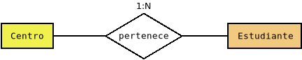

Programación con conectores
***************************
Como se ha podido ver hasta aquí, el acceso de una aplicación a una base de
datos relacional es relativamente sencillo y medianamente semejante sea cual
sea el lenguaje de programación y el |SGBD|. Por tanto, el usar de modo básico
conectores no entraña excesiva dificultad. Lo complicado, en realidad, es
abstraer al resto del programa del acceso, de modo que logremos que manipule
puramente objetos, aunque la información no esté almacenada según este modelo
en la base de datos.

Para lograr esta abstracción proponemos un patrón |DAO|, que separa por un lado los objetos del modelo de datos de nuestra aplicación y por otro los objetos que se encargan del acceso a la base de datos. Ilustrémoslo con un ejemplo muy sencillo: un conjunto de estudiantes que cursan estudios en centros de enseñanza:

que podemos codificar de este modo:

.. literalinclude:: files/Centro.java
   :language: java

.. literalinclude:: files/Estudiante.java
   :language: java

.. seealso:: Puede encontrar el código completo del ejemplo ilustrativo en
   `este repositorio de GitHub <https://github.com/josem-dam/ejemplo_conn>`_.

Como puede observarse, las dos definiciones son independientes del soporte de
almacenamiento y responden únicamente a la lógica de la aplicación\ [#]_. Para
simplicar las cosas obligamos a que todas estas clases incluyan un campo
identificador, de ahí que implementen una interfaz ``Entity``:

.. code-block:: java

   public interface Entity {
      public int getId();
      public void setId(int id);
   }

Si estas clases son ajenas a su persistencia, ¿cómo entonces se escribe o
recupera información de la base de datos? Esto es así, porque definiremos otras
clases, una por cada una de las clases del modelo, dedicadas a ello. Por tanto,
deberemos crear una para almacenar y recuperar centros y, otra para almacenar y
recuperar estudiantes.

En principio, para todos los objetos hay que implementar las mismas operaciones
de almacenamiento: inserción, recuperación, borrado y almacenamiento; así que
podemos definir una interfaz que cumplan todas estas clases relacionadas con el
almacenamiento en el backend:

.. literalinclude:: files/Crud.java
   :language: java

.. note:: La interfaz está definida en sqlutils_, no en el ejemplo ilustrativo.

.. admonition:: Aclaración

   Esta interfaz no tiene por qué ser definida exactamente así, pero
   básicamente implementa todas esas operaciones.

Son precisas algunas aclaraciones:

+ La interfaz es genérica, porque una clase orientada a almacenar estudiantes
  deberá recuperar estudiantes o admitir un estudiante cuando desea añadir datos
  a la base de datos, mientras que si está orientada a centros, deberá hacer lo
  propio con centros.

+ El método de inserción de varios objetos puede resultar redundante y,
  de hecho, se facilita una implementación predeterminada que consiste en
  insertar sucesivamente todos. Pero es útil porque da pie a que podamos
  implementar algo más eficiente, si así lo estimamos oportuno.

+ Hemos preferido que la obtención de todos los objetos de una misma clase se
  haga mediante un flujo para lo cual podemos usar el método
  ``SqlUtils.resultToStream`` de sqlutils_. Por supuesto es posible también
  alterar la firma del método para devolver |List|\ [#]_.

+ OPTIONAL: Comentar

Esta, pues, es la interfaz que cumpliran todas las clases encargadas de
comunicarse con la base de datos para extraer o guardar datos. Implementemos
ahora la clase para extraer o guardar objetos ``Centro``:

.. literalinclude:: files/Centro.java
   :language: java

Este objeto ``CentroSqlite`` recibe al ser construido la fuente de datos (el
|DataSource| ``ds``) y al realizar una operación, establece una conexión y
construye sobre ella la sentencia. Esta pensada para que se haya creado en otra
parte (una clase que mostraremos luego) un :ref:`pool de conexiones <conn-pool>`
a la base de datos en cuestión. Esa es la razón por la que alegremente nos
permitimos crear y cerrar objetos |Connection|.

Como puede verse, la implementación de sus métodos consiste en poner en práctica
lo aprendido en apartados anteriores: abrimos una conexión, construimos ls
sentencia |SQL| apropiada y la ejecutamos para realizar la operación. Tan sólo
tiene interés comentar el método que devuelve el ``Stream``, ya que por sus
particularidades, ha obligado a obrar de modo distinto:

.. code-block:: java

   @Override
   public Stream<Centro> get() throws DataAccessException {
       final String sqlString = "SELECT * FROM Centro";
       
       try {
           Connection conn = ds.getConnection();
           Statement stmt = conn.createStatement();
           ResultSet rs = stmt.executeQuery(sqlString);

           return SqlUtils.resultSetToStream(conn, rs, CentroSqlite::resultToCentro);
       }
       catch(SQLException err) {
           throw new DataAccessException(err);
       }
   }

Obsérvese que en este método, a diferencia de los anteriores, no cerramos la
conexión, ni la sentencia, ni el resultado, ya que de lo contrario no podremos
obtener centros del ``Stream`` devuelto. Quien se encargará de cerrar finalmente
todo será el propio flujo cuando se cierre, por lo que convendrá usar con él un
*try-with-resources*. Además, el primer argumento que recibe
``SqlUtils.resultToStream`` es la conexión, no la sentencia. Recordemos que el
objeto de este primer argumento se pasa, no porque sea útil para construir el
flujo, sino con la intención de poder cerrarlo cuando se cierre el flujo. Como
en este caso abrimos una conexión exclusivamente para llevar a cabo esta
operación, debemos cerrar la conexión, no simplemente el objeto |Statement|.

Necesitamos también crear una clase para la persistencia de los objetos
``Estudiante``. La clase ``EstudianteSqlite`` es semejante a la anterior, pero
hay una gran diferencia: uno de los atributos de ``Estudiante`` es un centro, lo
que supone que en la base de datos el campo es una clave foránea (un entero) que
hace referencia al registro de otra tabla. El problema de esta circunstancia se
produce cuando deseemos generar un objeto ``Estudiante`` a partir de una
operación de lectura (``.get`` en nuestra interfaz), ya que la consulta nos
devolverá el identificador del centro, no el centro en sí. Para abordar esta
dificultad tenemos dos vías:

+ Obtener automáticamente también el centro asociado al obtener el estudiante.
+ No hacerlo y posponer su obtención hasta que sea realmente necesario: cuando
  en la aplicación se ejecute el método ``.getCentro()``.

La primera vía es sencilla, aunque menos eficiente: si nunca llegamos a usar el
centro, habremos hecho una segunda consulta\ [#]_ inútil. La segunda vía es
perezosa, pero tiene el inconveniente de que es muy difícil de implementar, ya
que pasa por crear un objeto proxy que almacene inicialmente el identificador
del centro e intercepte las llamadas al método ``.getCentro()`` para que haga la
consulta con dicho identificador. En cualquier caso, tal implementación está
hecha en sqlutils_ y exige únicamente que se marque con una anotación el campo
como clave foránea (con ``@Fk``). Veamos cómo usar esta implementación:

.. code-block:: java

   private static Estudiante resultToEstudiante(ResultSet rs, DataSource ds) throws SQLException {
       int id = rs.getInt("id_estudiante");
       String nombre = rs.getString("nombre");
       Integer idCentro = rs.getInt("centro");
       if(rs.wasNull()) idCentro = null;
       LocalDate nacimiento = rs.getDate("nacimiento").toLocalDate();

       Estudiante estudiante = new Estudiante();
       Centro centro = null;

       // Carga inmediata: obtenemos inmediatamente el centro.
       //if(IdCentro != null) centro = new CentroSqlite(ds).get(IdCentro).orElse(null);

       // Carga perezosa: proxy al que se le carga la clave foránea
       FkLazyLoader<Estudiante> loader = new FkLazyLoader<>(estudiante);
       loader.setFk("centro", idCentro, new CentroSqlite(ds));
       estudiante = loader.createProxy();

       // Cargamos datos en el objeto y entregamos.
       return estudiante.cargarDatos(id, nombre, nacimiento, centro);
   }

Con lo hecho hasta ahora, tenemos definidas las clases del modelo y las clases
que permiten hacer persistentes los objetos de dichas clases (|DAO|).
Necesitamos también una clase para la conexión a la base de datos que se
encargue de:

+ Crear el pool de conexiones con el |DataSource| apropiado.
+ Realizar labores de inicialización. Por ejemplo, si la base de datos está
  vacía que la pueble con el esquema.
+ Que proporcione al resto de la aplicación los dos objetos |DAO| asociados a la
  persistencia de centros y estudiante.

Por tanto, esta clase para la conexión, sea cual sea el |SGBD|, tendrá que
cumplir esta interfaz:

.. literalinclude:: files/Conexion.java
   :language: java

Y la clase en sí tendrá esta implementación:

.. literalinclude:: files/ConexionSqlite.java
   :language: java

Como nuestra aplicación puede manejar varios |SGBD| distintos, tendremos que
realizar implementaciones análogas para todos ellos e implementar un `patrón
Factory <https://www.arquitecturajava.com/patron-factory-para-que-sirve/>`_ que
escoja el tipo adecuado de conexión.

Hecho eso, relacionarnos con la base de datos está totalmente encapsulado:

.. code-block:: java

   DateTimeFormatter formato = DateTimeFormatter.ofPattern("dd/MM/yyyy");

   // Estas opciones tendrán que obtenerse de algún modo.
   Map<String, Object> opciones = Map.of(
      "base", "sqlite",
      "url", "file::memory:?cache=shared",
      "user", "",
      "password", ""
   );

   // Aplicamos el patrón factory para elegir la conexión adecuada.
   Conexion conexion = BackendFactory.crearConexion(opciones);

   // Objetos para gestionar la persistencia de centros y estudiantes.
   Crud<Centro> centroDao = conexion.getCentroDao();
   Crud<Estudiante> estudianteDao = conexion.getEstudianteDao();

   Centro astaroth = new Centro(11701164, "IES Astaroth", "pública");
   centroDao.insert(astaroth);        // Hacemos persistente el centro.

   Estudiante estudiante = new Estudiante(1, "Perico de los palotes", LocalDate.parse("10/12/2010", formato), astaroth),
   estudianteDao.insert(estudiante);  // Hacemos persistente el estudiante.

   // Nos olvidamos de ambos objetos.
   centro = null;
   estudiante = null;

   estudiante = estudiante.get(1).orElse(null);   // Perico.
   astaroth = estudiante.getCentro();  // Astaroth.

   // Debemos asegurarmos de cerrar el Stream
   // para no dejar abierto el objeto Connection asociado.
   try(Stream<centro> centros = centroDao.get()) {
      centros.forEach(System.out::println);
   }

   // Borramos el centro.
   centroDao.delete(astaroth);

   centroDao.get(11701164) == Optional.empty();  // true

.. rubric:: Notas al pie

.. [#] Hemos incluido, eso sí, una anotación en el campo ``centro`` de
   ``Estudiante`` que lo identifica como clave foránea. Pero no deja de ser una
   mera anotación. Esta anotación está definida en sqlutils_.

.. [#] La ventaja de ``Stream`` es su evaluación perezosa; las desventajas son
   dos: nos veremos obligados a usar sqlutils_ y, además, se debe ser más
   cuidadoso al utilizarla ya que debemos asegurarnos de que quien cierra la
   conexión es el propio Stream.

.. [#] En realidad, en vez de hacer una segunda consulta, podríamos hacer una
   consulta compuesta para obtener estudiante y centro.

.. _sqlutils: https://github.com/sio2sio2/sqlutils

.. |DAO| replace:: :abbr:`DAO (Data Access Object)`
.. |SGBD| replace:: :abbr:`SGBD (Sistema Gestor de Bases de Datos)`
.. |List| replace:: :java-util:`List`.
.. |SQL| replace:: :abbr:`SQL (Structured Query Language)`.
.. |DataSource| replace:: :java-sql:`DataSource`.
.. |Connection| replace:: :java-sql:`Connection`
.. |Statement| replace:: :java-sql:`Statement`

