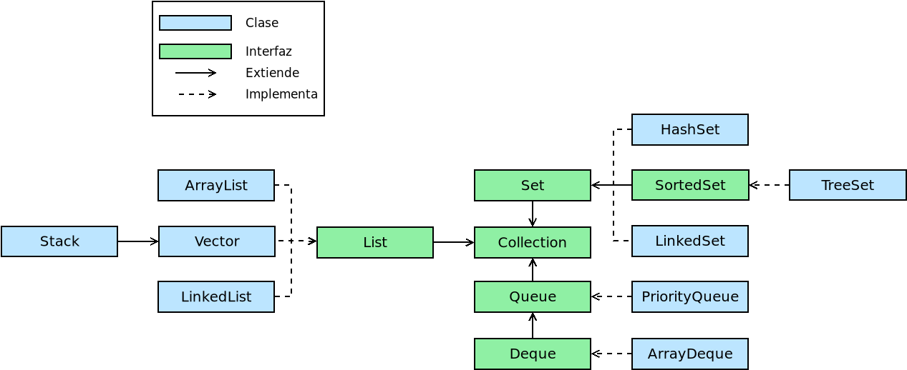
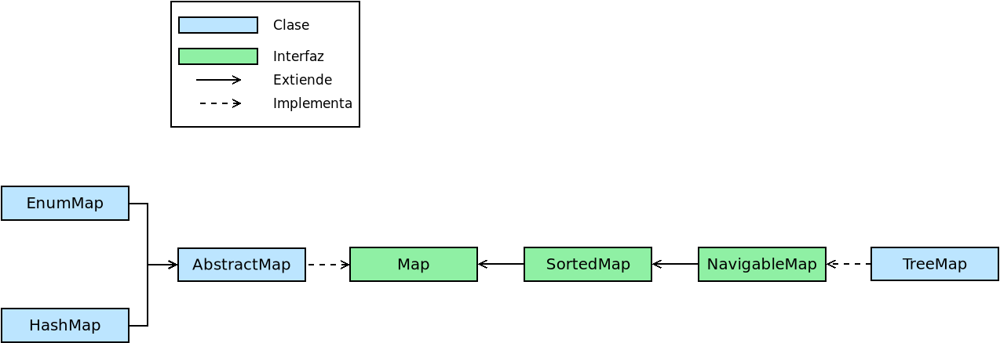

Colecciones
***********
.. note:: Las colecciones, en realidad, están disponibles desde muy
   tempranamente (desde `Java1.2
   <https://en.wikipedia.org/wiki/Java_version_history#J2SE_1.2>`_ en 1998). Se
   incluyen, no obstante, porque se usan habitualmente en el estilo funcional de
   programación.

El tipo más básico de agrupar datos en *Java* es el *Array*:

.. code-block:: java

   String[] s = new String[] {"A", "B", "C"}; // O, simplemente, {"A", "B", "C"}
   int[] t  = new int[3];  // Pone todos los elementos a 0.

Sin embargo, en su creación hay que establecer un tamaño determinado y no
siempre es posible prever cuántos serán los elementos que contendrá como máximo.
Para solucionar estos casos existe la interfaz :java-util:`Collection<E>
<Collection>` que extiende :java-lang:`Iterable<E> <Iterable>`.

.. note:: Para convertir una *array* existente en una lista puede usarse
   :java-util:`Arrays.asList <Arrays>`:

   .. code-block:: java

      String[] s = new String[] {"A", "B", "C"};
      Arrays.asList(s); // ["A", "B", "C"]

.. _java-collection:

Collection
==========
:java-util:`Collection` es una interfaz que representa un grupo de objetos, cada
uno de los cuales se llama "elemento". Dependiendo de implementaciones más
específicas los elementos podrán estar ordenador (:java-util:`List`) o
desordenados (:java-util:`Set`).

Interfaz
--------
Esta interfaz recoge todos los métodos que describen los comportamientos
asociados a que el objeto sea una colección entre ellos:

``size()``
   que devuelve la cantidad de elementos que contiene la colección.

``add(E e)`` y ``addAll(Collection<E> c)``
   que añaden a la colección un nuevo elemento o todos los elementos de otra
   colección.

``remove(E e)`` y ``removeAll(Collection<E> c)``
   que eliminan en vez de añadir.

``removeIf(Predicate<E> filter)``
   que elimina los elementos que cumplen el predicado que hace de filtro. Por
   ejemplo:

   .. code-block:: java

      Collection<Integer> c = new ArrayList<>(List.of(1, 2, 3, 4, 5, 6));
      c.removeIf(n -> n % 2 == 0);  // Elimina todos los números pares.

``clear()``
   que vacía la colección.

``isEmpty()``
   que comprueba si la colección está vacía.

``equals(Object o)``
   que comprueba si dos colecciones son iguales:

   .. code-block:: java

      Collection<Integer> c = new ArrayList<>(List.of(1, 2, 3, 4, 5, 6));
      c.removeIf(n -> n % 2 == 0);
      Collection<Integer> d = new ArrayList<>(List.of(1, 3, 5));
      c.equals(d); // true

``contains(Object o)``
   que comprueba si el objeto está incluido en la colección.

``containsAll(Collection<E> c)``
   que comprueba si todos los objetos de la colección suministrada se encuentran
   en la colección.

``stream()``
   que devuelve un :ref:`flujo <java-stream>` con los elementos de la colección.

``toArray()``
   que devuelve un array con los elementos de la colección. Sin argumentos, los
   elementos del array generado se considerarán objetos de tipo ``Object`` con
   lo que normalmente interesa especificar el tipo particular:

   .. code-block:: java

      Collection<Integer> c = new ArrayList<>(List.of(1, 2, 3, 4, 5, 6));
      c.toArray(Integer[]::new); // también c.toArray(new Integer[0]);

Además, como las colecciones son iterables, siempre podremos usar con ellas una
estructura de tipo `for-each`:

.. code-block:: java

   // Dependiendo de la naturaleza de "c" podremos o no predecir el orden.
   for(Integer n: c) {
      System.out.println(c);
   }

o el método ``.forEach(Consumer<E> c)``.

.. caution:: No todas las colecciones son mutables, por lo que con aquellas que
   no lo sean no será posible usar los métodos que alteran su contenido
   (``add``, ``remove``, etc.)

Implementaciones
----------------
Dependiendo de las características que deseamos que presenten las colecciones,
deberemos elegir la implementación más apropiada.

.. _java-list:

Listas
""""""
La naturaleza de algunas implementaciones es la de una secuencia ordenada de
elementos a los cuales se puede acceder individualmente (:java-util:`List`). Por
eso se añaden métodos como:

``get(int i)``
   que permite obtener el elemento i-ésimo.

``indexOf(Object o)`` y ``lastIndexOf(Object o)``
   que obtienen respectivamente la posición de la primera y la última ocurrencia
   del objeto que se proporciona como argumento.

``add(int i, E e)``
   que añade un nuevo elemento en la posición especificado.

``set(int i, E e)``
   que lo sustituye en vez de añadirlo.

``remove(int i)``
   que elimina el elemento i-ésimo.

``sort(Comparator<E> c)``
   que reordena los elementos utilizando el :java-util:`comparador
   <Comparator>` facilitado en el argumento.

``subList(int i, int j)``
   que devuelve una lista con los elementos incluidos entre la posición "i" y la
   "j" (este último sin incluir).

``replaceAll(UnaryOperator<E> o)``
   sustituye cada elemento por el resultado de aplicarle la función suministrada
   como argumento.

   .. note:: Nótese que es el típico `map` de la programación funcional, pero
      alterando la propia colección y no generando una nueva.

Implementaciones particulares de las listas son:

:java-util:`ArrayList <ArrayList>`
   se comporta, digámoslo así, como un array de dimensiones dinámicas, de manera
   que, a diferencia de aquellos, podemos ir incrementando su tamaño a voluntad.
   En principio, tiene un tamaño suficiente para almacenar los elementos que
   contiene, pero si se añaden tantos que se vuelve insuficiente, se
   redimensiona automáticamente.

   .. code-block:: java

      List<String> al = new ArrayList<>();
      al.add("A");
      al.add("B");
      al.size(); // 2
      al.get(1); // B
      al.trimToSize(); // Error.
      ((ArrayList) al).trimToSize(); // No da problemas.

   .. note:: Obsérvese que no se ha definido la variable `al` como `ArrayList`,
      sino como `List`. Esto significa que tendremos disponibles los métodos
      definidos en la interfaz :java-util:`List <List>`, pero no los que añade
      la clase `ArrayList`.

:java-util:`Stack <Stack>`
   es la implementación de una `pila
   <https://es.wikipedia.org/wiki/Pila_(inform%C3%A1tica)>`_ y añade algunos
   método propios de su uso como tal:

   ``push(E e)``
      que añade un elemento en lo alto de la pila (equivale a usar ``add``).

   ``pop()``
      que devuelve eliminándolo el elemento en lo alto de la pila.

   ``peek()``
      que devuelve sin eliminarlo el elemento en lo alto de la pila.

   ``search(Object o)``
      que devuelve la primera posición en la que se encuentra el elemento
      suministrado. En este caso, se empieza a contar por **1** desde lo alto de
      la pila.

   ``empty()``
      comnprueba si la pila está vacía (hace pues lo mismo que ``isEmpty``).

   .. caution:: Por supuesto, los métodos de las interfaces que implemente están
      disponibles, pero es absurdo utilizarlos, porque en ese caso es muy
      probable que lo que se necesitase es un `ArrayList`, y no una pila.

.. caution:: Cuando se define el método de una clase es conveniente que los
   tipos de sus argumentos sean los mas generales posibles. Por ejemplo, si lo
   único que se pretende hacer dentro del método es recorrer el grupo de objetos
   con una estructura *foreach*, debería definirse el método como:

   .. code-block:: java

      int foobar(Iterable data);

   y no:

   .. code-block:: java

      int foobar(ArrayList data);

Conjuntos
"""""""""
Los conjuntos (:java-util:`Set`) agrupan datos que no pueden repetirse por lo
que:

.. code-block:: java

   Set<Integer> s = new HashSet<>();
   s.add(1);  // true, añadimos 1 al conjunto.
   s.add(1);  // false, no no se añade pues ya está.

Además, no tienen en principio orden, por lo que referirlos mediante un índice
carece de sentido; y no añade como la interfaz :ref:`List <java-list>` métodos
relacionados con la posición que ocupan los elementos.

:java-util:`HashSet <HashSet>`
   Es una clase para construir conjuntos tal y como los hemos descrito.

:java-util:`TreeSet <TreeSet>`
   Es una clase que implementa la interfaz :java-util:`SortedSet <SortedSet>` y
   que se diferencia de los conjuntos anteriores en que sí existe un orden: los
   elementos se ordenan según su orden natural si existiera (p.e. los enteros o
   las cadenas tienen definido un orden) o según el :java-util:`comparador
   <Comparator>` que se proporciona al crear el objeto:

   .. code-block:: java

      SortedSet<Integer> ts1 = new TreeSet<>();
      ts1.add(100);
      ts1.add(1000);
      ts1.add(1);
      ts1.add(10);
      ts1; // [1, 10, 100, 1000]
      SortedSet<Integer> ts2 = new TreeSet<>((a, b) -> a>b?-1:1);
      ts2.addAll(ts1);
      ts2; // [1000, 100, 10, 1]

   Los métodos que añade `SortedSet` tiene relación con la existencia del orden:

   ``first()``
      que devuelve el primer elemento.

   ``last()``
      que devuelve el último.

   ``headSet(E e)``
      que devuelve un subconjunto con los elementos anteriores al suministrado.

   ``tailSet(E e)``
      que devuelve un subconjunto con el propio elemento suministrado y todos los
      posteriores.

   ``subSet(E e1, E e2)``
      que devuelve el subconjunto de elementos entre el primero y el segundo
      (éste último sin incluir).

.. _java-map:

Map
===
Los mapas son objetos que contienen parejas clave-valor. En *Python* reciben el
nombre de *diccionarios*.

Interfaz
--------
La interfaz básica :java-util:`Map<K, V> <Map>` recoge los métodos comunes a
todos los mapas:

``size()``
   que devuelve

``clear()``
   que vacía el mapa.

``isEmpty()``
   que comprueba si el mapa está vacío.

``containsKey(Object o)``
   que devuelve ``true`` si existe la clave suministrada.

``containsValue(Object o)``
   que devuelve ``true`` en caso de que alguna clave contenga el valor
   suministrado.

``put(K k, V v)`` y ``putIfAbsent(K k, V v)``
   que añade la clave "k" con valor "v". Si la clave, ya existe, sustituye su
   valor y devuelve el que había. El segundo método sólo añade la clave, si no
   existe previamente.

``putAll(Map<K, V> m)``
   que copia todas las parejas clave-valor del mapa proporcionado.

``get(K k)`` y ``getOrDefault(K k, V v)``
   que devuelve el valor correspondiente a la clave "k" o ``null`` si la clave no
   existe. El segundo método devuelve, en caso de no existir la clave, el valor
   que se pasa como segundo argumento.

``remove(K k)`` y ``remove(K k, V v)``
   que elimina la pareja clave-valor de clave k. La segunda versión del método
   sólo elimina la pareja si también tiene el valor especificado.

``replace(K k, V v)``
   que sustituye el valor de la pareja clave-valor de clave "k".

``replaceAll(Bifunction<K, V, V> transformer)``
   que sustituye el valor de cada pareja según la función proporcionada.

``forEach(Biconsumer<K, V> action)``
   que para cada clave pareja-valor ejecuta la función suministrada como
   argumento.

``keySet()``
   que devuelve un conjunto cuyos elementos son las claves del mapa.

``entrySet()``
   que devuelve un conjunto cuyos elementos son parejas clave-valor en la forma
   :java-util:`Map.Entry <Map.Entry>`:

   .. code-block:: java

      Map<String, String> m = new HashMap<>();
      m.put("A", "uno");
      m.put("B", "dos");
      m.put("C", "tres");
      m.entrySet.forEach(e -> System.out.printf("%s=>%s\n", e.getKey(), e.getValue()));

``values()``
   que devuelve una :ref:`colección <java-collection>` con todos los valores.

Implementaciones
----------------
Citaremos dos implementaciones de esta interfaz:

HashMap
"""""""
:java-util:`HashMap<K, V> <HashMap>` es la implementación que permite la
creación de mapas tal y como los hemos explicado y que se asemejan a los de
otros lenguajes como *Python*.

TreeMap
"""""""
:java-util:`TreeMap<K, V> <TreeMap>` es un mapa ordenado en el que sus claves se
ordenan según su orden natural o el comparador que facilitemos al construirlo
como argumento del constructor:

.. code-block:: java

   // Ordenado según el orden alfabético de sus claves (que son cadenas)
   Map<String, Integer> m = new TreeMap<>();
   m.put("X", 100);
   m.put("B", 6);
   m.put("H", 50001);
   m.values(); // [6, 50001, 100]: La colección de valores siempre se ordena así.
   
Añade, a los métodos propios de :ref:`Map <java-map>` otros que tiene relación
con que las claves estén ordenadas. Por ejemplo, ``floorKey(K k)`` devuelve la
clave mayor en el mapa que sea menor o igual a la que se suministra como
argumento:

.. code-block:: java

   m.floorKey("F"); // Devuelve "B".

.. https://www.geeksforgeeks.org/difference-between-list-and-arraylist-in-java/
